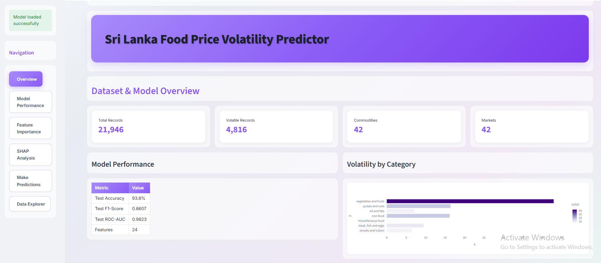

# Food Price Volatility Prediction using CatBoost
A machine learning project that predicts food price volatility in Sri Lanka using the CatBoost algorithm.

## Overview

This project builds a binary classification model to predict whether a food commodity will experience high price volatility (price change exceeding ±20%) in the next recording period.

| Metric | Value |
|--------|-------|
| Algorithm | CatBoost |
| Accuracy | 94% |
| Dataset | WFP Sri Lanka Food Prices (2004-2025) |

## Dataset

**Source**: [World Food Programme (WFP) Food Prices Database](https://data.humdata.org/dataset/wfp-food-prices-for-sri-lanka)

- **Records**: 23,907
- **Time Period**: February 2004 - September 2025
- **Coverage**: 9 provinces, 25 districts, 44 markets, 42 commodities, 7 categories

## Target Variable

The target variable `high_volatility` is **created** from price data:

```
high_volatility = 1  if |price_change_pct| > 20%
                  else 0 
```

**Class Distribution**: 78.1% Stable, 21.9% Volatile

## Features

24 features engineered across 6 categories:

| Category | Features | Description |
|----------|----------|-------------|
| **Categorical** (5) | admin1, admin2, market, category, commodity | Location and product information |
| **Temporal** (6) | year, month, quarter, is_maha_season, is_yala_season, is_festive_period | Time-based patterns |
| **Lag** (6) | price_lag_1, price_change_lag_1, rolling_mean_3, rolling_std_3, rolling_volatility_3, price_momentum | Historical price patterns |
| **Price-Based** (4) | price, z_score, price_vs_annual_avg, price_percentile | Price statistics |
| **Geographic** (2) | distance_from_colombo, is_conflict_region | Location-based features |
| **Commodity** (1) | is_essential | Essential commodity flag |

## Model Performance

| Metric | Train | Validation | Test |
|--------|-------|------------|------|
| Accuracy | 0.940 | 0.939 | 0.938 |
| Precision | 0.859 | 0.853 | 0.849 |
| Recall | 0.869 | 0.870 | 0.872 |
| F1-Score | 0.864 | 0.861 | 0.860 |
| ROC-AUC | 0.984 | 0.983 | 0.982 |

### Top 5 Important Features (SHAP Analysis)

1. `rolling_volatility_3` - Historical 3-month volatility
2. `price_momentum` - Price deviation from recent average
3. `rolling_std_3` - 3-month price standard deviation
4. `price_change_lag_1` - Previous month's price change
5. `z_score` - Standardized price deviation

## Installation

### Prerequisites

- Python 3.8 or higher
- pip package manager

### Setup

1. **Clone the repository**
   ```bash
   git clone https://github.com/GayaaniD/srilankan-food-price-prediction.git
   ```

2. **Create virtual environment (recommended)**
   ```bash
   python -m venv venv
   
   # Windows
   venv\Scripts\activate
   
   # Linux/Mac
   source venv/bin/activate
   ```

3. **Install dependencies**
   ```bash
   pip install -r requirements.txt
   ```

## Usage

### Step 1: Train the Model

```bash
python catboost_train_model.py
```

### Step 2: Launch Dashboard

```bash
streamlit run streamlit_app.py
```

Open your browser at `http://localhost:8501`

## Streamlit Dashboard


The interactive dashboard includes 6 pages:
- **Overview** : Dataset statistics, model summary, volatility by category 
- **Model Performance** : Metrics comparison, confusion matrix, ROC & PR curves 
- **Feature Importance** : Interactive feature importance visualization 
- **SHAP Analysis** : Feature impact exploration with distribution plots 
- **Make Predictions** : Input commodity details and get volatility predictions 
- **Data Explorer** : Filter and explore the underlying dataset 
